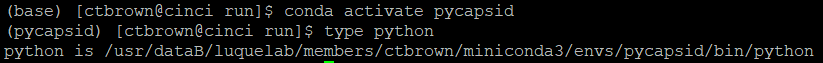

1. The first step to running pyCapsid on the cluster is installing pyCapsid in dedicated conda environment as described in 
its [installation documentation.](https://luquelab.github.io/pyCapsid/installation/#via-conda) 
2. Once you've done that, activate the environment using `conda activate` and note the path to the python interpreter of that environment using 
`type python`. For example:

3. Create a folder in which you will store the results of pyCapsid. Note the path of the folder using `pwd`.
4. Inside that folder create a file named `config.toml` or download an example config.toml from [here](https://github.com/luquelab/pyCapsid/blob/main/docs/tutorial/config_simple.toml).
Adjust the contents of this config file to the desired set of parameters. A more detailed  config file with more of the available options can be found [here](https://github.com/luquelab/pyCapsid/blob/main/docs/tutorial/conf_example.toml).
5. Next create a python file with your preferred name, i.e. `run_pycap.py`. The contents of that file should look like this:
    ```python
    #!/usr/dataB/luquelab/members/ctbrown/miniconda3/envs/pycapsid/bin/python # This is the path to your python interpreter noted in step 2
    #PBS -l nodes=1:ppn=24 # This requests a single node with 24 processors per node. This corresponds to the 4 higher quality nodes on the CSRC cluster. Remove the ppn requirement to use any node.
    #PBS -l walltime=18:00:00 # This specifies the maximum time the job will run before being terminated
    #PBS -d "/usr/dataB/luquelab/members/ctbrown/pyCapsid/pyCapsid/run/" # This specifies the working directory, and should be the directory you created in step 3
    #PBS -j oe # This combines the standard output and standard error logs
    
    from pyCapsid import run_capsid_report
    run_capsid_report('config.toml') # make sure the filename provided here is the same as the config file you created.
    ```
6. Check that you set the parameters in `config.toml` correctly and submit the job using `qsub run_pycap.py`.
7. This will create a folder with the same name that was specified in the config file. You can copy this folder to your 
local machine using the scp command.
