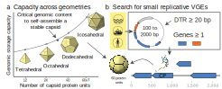

# Project: Perpetual Viral Origins
+ ### Principal Investigators: [Forest Rohwer](https://scholar.google.com/citations?hl=en&user=ALEZEdoAAAAJ), [Rob Edwards](https://scholar.google.com/citations?hl=en&user=e7fvl1kAAAAJ), [Anca Segall](https://scholar.google.com/citations?hl=en&user=p1mzR2gAAAAJ), and [Antoni Luque](https://scholar.google.com/citations?user=ytvnI68AAAAJ&hl=en).
+ ### Centers involved: [Viral Information Institute](https://viralization.org) and [Flinders Accelerator for Microbiome Exploration](https://fame.flinders.edu.au).

The research plan is a guide to the intellectual work to be developed in the postdoctoral fellowship. However, as the research unfolds, the priorities and scope of the research may pivot.

## Summary
This project will combine laboratory, bioinformatics, and computer simulations to compare and test the *perpetual viral origins hypothesis* versus the paradigmatic *spillover hypotheses*. The project is the joint effort of four groups with different expertise and will train three postdoctoral fellows in interdisciplinary science. The research is supported by the Gordon and Betty Moore Foundation.

The *perpetual viral origins hypothesis* predicts that new viruses arise continually from a globally distributed gene pool of *virus-generating elements*. The *spillover hypothesis* is based on descending by modification and predicts that new viruses form as variants of existing viruses. Testing the *perpetual viral origins hypothesis* has major implications for understanding the origin of viruses. Discarding it would imply a limited capacity of viruses to adapt to new environmental conditions. Confirming it would imply that completely new viruses can form regularly and could amplify genes that may help adapt life to dramatic environmental changes. Rates of spillovers and the perpetual origin of new viruses will be quantified and used to parameterize ecological and evolutionary models. Consolidated databases of the global virome will be developed and analyzed to identify novel, unknown proteins, diversity-generating retroelements (DGRs), and *small capsid elements*. 

## Research plan associated with the modeling part of the project
The postdoctoral fellow leading the modeling effort will work under the supervision of Antoni Luque as part of the Viral Information Institute, Computational Science Research Center, and Departments of Mathematics & Statistics at San Diego State University. This part of the project is associated with the third aim of the grant. It will develop the mathematical prediction of biophysical and evolutionary parameters governing the *perpetual viral origins hypothesis*. This aim will determine the minimal structural protein sequence length and composition capable of forming stable capsids that store their own genomic information (Year 1). Examples of such proteins will be searched bioinformatically within small circular contigs (< 2 kbp) obtained from viromes and metagenomes (Year 2). The probability and cost of selecting and propagating adaptive mutations in *virus-generating elements* will be estimated by combining molecular evolutionary theory, the metabolic theory of ecology, and stochastic simulations (Year 3).

**Determine the smallest structural proteins capable of assembling *virus-generating elements*.** In Year 1, the shortest structural protein (amino-acid length) capable of building a stable *virus-generating element* capsid will be determined for helical, tetrahedral, octahedral, dodecahedral, and icosahedral capsid geometries (Luque and Reguera 2010; Luque et al. 2010; Twarock and Luque 2019) (Figure 1a). The selected capsids will have an internal volume that accommodates at least the genomic information of the encoded structural protein. The structural protein’s amino-acid composition (hydrophobic and charged residues) will be estimated using the classical nucleation theory of capsids, which will establish the protein-protein and protein-genome interactions necessary to assemble *virus-generating elements* (VGE) particles spontaneously (Luque et al. 2012). The interaction strength will determine the protein surface (number of amino acids) containing hydrophobic patches (for protein-protein interactions) and positively charged patches (for protein-genome interactions) (Kegel and Schoot Pv 2004). These interaction patches will be selected to produce a capsid assembly rate constrained to occur within-host generation times observed environmentally (Luque and Silveira 2020; Silveira, Luque, and Rohwer 2021). This will determine the assembly yield and decay rate of the different VGE capsid geometries. Coarse-grained molecular simulations will validate and refine the predictions from classical nucleation theory (Luque, Zandi, and Reguera 2010; Luque et al. 2012, 2014; Luque, Ozer, and Schlick 2016), providing the assembly pathway and kinetic traps of the most stable VGE geometries.

**Figure 1. Structural self-replicating *virus-generating elements*.** a) The genome capacity of capsids increases with its geometrical complexity (number of capsid protein units). b) Targeted small circular genomes (direct terminal repeats, DTR) from metagenomes and smallest structural candidate found in our prior analysis, including the folded capsid protein (CP) and predicted capsid enclosing the genome. 

**Environmental evidence of structural proteins forming *virus-generating elements*.** Small circular contigs will be selected from metagenomes and viromes. The selected contigs will have lengths of smaller than 2 kb, at least one open reading frame, and direct terminal repeats > 20 bp (Figure 1b). This will push the limits of the small putative viral genomes that we have obtained recently (Luque et al. 2020). The proteins will be folded with I-TASSER and AlphaFold. The contig length will determine the possible capsid geometries. The stability of the capsids will be tested using coarse-grained molecular simulations (Luque, Zandi, and Reguera 2010; Luque et al. 2012, 2014; Luque, Ozer, and Schlick 2016). The proteins forming stable capsids will be compared with known (viral and non-viral) shell proteins phylogenetically (MUSCLE) and structurally (DALI). The contigs containing these potential structural *virus-generating element* proteins will be synthesized as part of the experiments in specific aim one.

**Evolutionary consequences of the *perpetual viral origins hypothesis*.** The *spillover hypothesis* predicts that viral evolution largely occurs via mutational drift, whereas the *perpetual viral origins hypothesis* predicts that viral evolution occurs largely via reassortment of genes and/or modules into novel genomic arrangements. In Year 3, a theoretical analysis will estimate the impact of *virus-generating elements* propagating fixed mutations in a community via recombination using the rates observed in specific aim one. The theoretical model will estimate the energetic cost and propagation dynamics of an adapted gene within a microbial community in the *spillover hypothesis* versus the *perpetual viral origins hypothesis*. The model will assume that a community faces a change in environmental conditions (e.g., temperature, salinity) and that a specific mutation in a gene would provide a positive selection. The probability of generating this specific mutation in *virus-generating elements*, viruses, and bacteria in a community will be calculated using Drake’s rule (Drake et al. 1998; Sung et al. 2012). The number of replication cycles required will be coupled with the metabolic theory of ecology to estimate the heat produced by the community to fix that mutation in genomes (Brown et al. 2004; DeLong et al. 2010). A system of seven dynamical equations will monitor the propagation of this fixed mutation and the accumulated heat. It will use three compartments: Bacteria, viruses, and *virus-generating elements*. Each compartment will contain two effective subpopulations: One with and one without the fixed mutation. In the *perpetual viral origins hypothesis*, the mutation could be fixed independently in the viral, bacterial, or *virus-generating elements* compartments, and recombination can propagate the mutation between compartments. In the *spillover hypothesis* model, the *virus-generating elements* compartment will not be included. The system will be parametrized stochastically using Latin hypercube sampling (1,000,000 samples per scenario). The parameters will be determined by combining meta-analyses of empirical data and first-principle physical estimates, analogously to our recent approach investigating the integration and propagation of proviruses in bacterial communities (Joiner et al. 2019; Anthenelli et al. 2020; Luque and Silveira 2020; Silveira, Luque, and Rohwer 2021). The dynamics of the fraction of bacterial subpopulations accumulating the fixed mutation and total dissipated heat (energy cost) will be the main outcomes comparing the *spillover hypothesis* versus the *perpetual viral origins hypothesis*. Our working hypothesis is that *virus-generating elements* will lead to a more punctuated and energetically efficient generation and propagation of fixed mutations. This is based on our initial estimates, which predict that the metabolic cost of fixing a mutation increases exponentially with the genome size.

**Deliverables:**
1. We will determine the theoretical limit of small structural protein properties (amino-acid length and composition) capable of building self-replicating capsids.
2. We will identify bioinformatically small capsid *virus generating elements* for comparison with the theoretical limit predicted in deliverable one and test in specific aim one.
3. We will determine the energetic theoretical cost and dynamic of fixing a mutation in a microbial community via the *perpetual viral origins hypothesis* versus the *spillover hypothesis*.

## References
Anthenelli, Maxwell, Emily Jasien, Robert Edwards, Barbara Bailey, Ben Felts, Parag Katira, James Nulton, Peter Salamon, Forest Rohwer, Cynthia B. Silveira, Antoni Luque. 2020. “Phage and Bacteria Diversification through a Prophage Acquisition Ratchet.” BioRxiv. <https://doi.org/10.1101/2020.04.08.028340>.

Brown, James H., James F. Gillooly, Andrew P. Allen, Van M. Savage, and Geoffrey B. West. 2004. “Toward a Metabolic Theory of Ecology.” Ecology 85 (7): 1771–89. <https://doi.org/10.1890/03-9000>.

DeLong, John P., Jordan G. Okie, Melanie E. Moses, Richard M. Sibly, and James H. Brown. 2010. “Shifts in Metabolic Scaling, Production, and Efficiency across Major Evolutionary Transitions of Life.” Proceedings of the National Academy of Sciences of the United States of America 107 (29): 12941–45. <https://doi.org/10.1073/pnas.1007783107>.

Drake, J. W., B. Charlesworth, D. Charlesworth, and J. F. Crow. 1998. “Rates of Spontaneous Mutation.” Genetics 148 (4): 1667–86. <https://doi.org/10.1093/genetics/148.4.1667>.

Joiner, Kevin L., Arlette Baljon, Jeremy Barr, Forest Rohwer, and Antoni Luque. 2019. “Impact of Bacteria Motility in the Encounter Rates with Bacteriophage in Mucus.” Scientific Reports 9 (1): 16427. <https://doi.org/10.1038/s41598-019-52794-2>.

Kegel, Willem K., and Paul van der Schoot Pv. 2004. “Competing Hydrophobic and Screened- Coulomb Interactions in Hepatitis B Virus Capsid Assembly.” Biophysical Journal 86 (6): 3905–13. <https://doi.org/10.1529/biophysj.104.040055>.

Luque, Antoni, and David Reguera. 2010. “The Structure of Elongated Viral Capsids.” Biophysical Journal 98 (12): 2993–3003. <https://dx.doi.org/10.1016%2Fj.bpj.2010.02.051>.

Luque, Antoni, Roya Zandi, and David Reguera. 2010. “Optimal Architectures of Elongated Viruses.” Proceedings of the National Academy of Sciences of the United States of America 107 (12): 5323–28. <https://doi.org/10.1073/pnas.0915122107>.

Luque, Antoni, David Reguera, Alexander Morozov, Joseph Rudnick, and Robijn Bruinsma. 2012. “Physics of Shell Assembly: Line Tension, Hole Implosion, and Closure Catastrophe.” The Journal of Chemical Physics 136 (18): 184507. <https://doi.org/10.1063/1.4712304>.

Luque, Antoni, Rosana Collepardo-Guevara, Sergei Grigoryev, and Tamar Schlick. 2014. “Dynamic Condensation of Linker Histone C-Terminal Domain Regulates Chromatin Structure.” Nucleic Acids Research 42 (12): 7553–60. <https://doi.org/10.1093/nar/gku491>.

Luque, Antoni, Gungor Ozer, and Tamar Schlick. 2016. “Correlation among DNA Linker Length, Linker Histone Concentration, and Histone Tails in Chromatin.” Biophysical Journal 110 (11): 2309–19. <https://doi.org/10.1016/j.bpj.2016.04.024>.

Luque, Antoni, and Cynthia B. Silveira. 2020. “Quantification of Lysogeny Caused by Phage Coinfections in Microbial Communities from Biophysical Principles.” MSystems 5 (5). <https://doi.org/10.1128/mSystems.00353-20>.

Luque, Antoni, Sean Benler, Diana Y. Lee, Colin Brown, and Simon White. 2020. “The Missing Tailed Phages: Prediction of Small Capsid Candidates.” Microorganisms 8 (12). <https://doi.org/10.3390/microorganisms8121944>.

Silveira, Cynthia B., Antoni Luque, and Forest Rohwer. 2021. “The Landscape of Lysogeny
across Microbial Community Density, Diversity and Energetics.” Environmental
Microbiology, June. <https://doi.org/10.1111/1462-2920.15640>.

Sung, Way, Matthew S. Ackerman, Samuel F. Miller, Thomas G. Doak, and Michael Lynch. 2012. “Drift-Barrier Hypothesis and Mutation-Rate Evolution.” Proceedings of the
National Academy of Sciences of the United States of America 109 (45): 18488–92. <https://doi.org/10.1073/pnas.1216223109>.

Twarock, Reidun, and Antoni Luque. 2019. “Structural Puzzles in Virology Solved with an
Overarching Icosahedral Design Principle.” Nature Communications 10 (1): 4414. <https://doi.org/10.1038/s41467-019-12367-3>.

